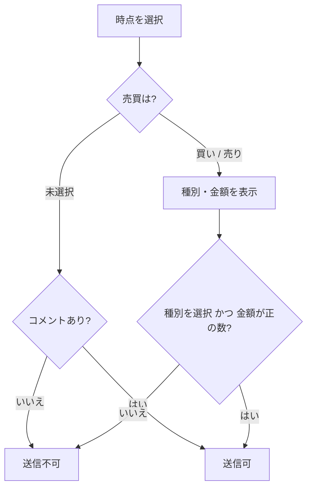
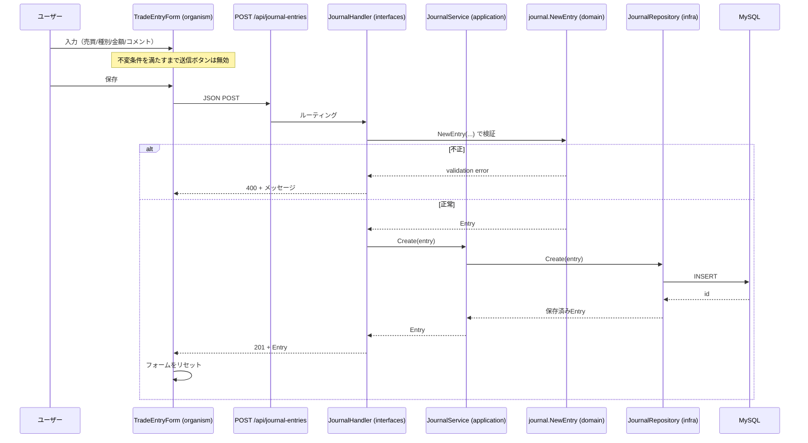
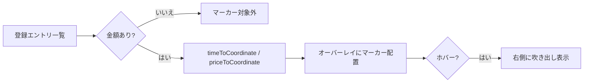

# ポジション記録（FR-02 / FR-03）

チャート上で選択した時点に対し、**ポジション記録**（売買方向・種別・金額）または**コメントのみ**の記録を登録する。

関連要件: [FR-02 ポジション記録](../requirements/04-functional/FR-02-positions.md) / [FR-03 コメント記録](../requirements/04-functional/FR-03-comments.md)

## データモデル

`journal_entries` テーブル（[db/init/002_journal_entries.sql](../../db/init/002_journal_entries.sql)）。1レコードが「ポジション記録」または「コメントのみ」のどちらかを表す。

| カラム | 型 | 説明 |
| --- | --- | --- |
| `id` | BIGINT | 主キー |
| `contract` | VARCHAR(10) | 限月 |
| `ts` | DATETIME(UTC) | 対象時点（選択した足の時刻） |
| `side` | VARCHAR(5) NULL | `long` / `short`（NULL = コメントのみ） |
| `trade_type` | VARCHAR(5) NULL | `open`(新規) / `close`(決済) |
| `price` | DECIMAL(12,2) NULL | 約定金額 |
| `comment` | TEXT NULL | コメント |
| `created_at` | DATETIME | 登録日時 |

## 入力フォームの振る舞い

- **売買**（ラジオ）: 未選択 / 買い(long) / 売り(short)
- 売買で **買い/売り** を選ぶと、追加で以下が表示される:
  - **種別**（ラジオ）: 新規(open) / 決済(close)
  - **金額**（数値入力）
- **コメント**（テキスト）は常に表示。
- **送信可否（バリデーション）**:
  - 未選択（コメントのみ）→ コメントが非空なら送信可
  - 買い/売り → 種別が選択済み **かつ** 金額が正の数 のとき送信可（コメントは任意）

> バリデーションはフロント（送信ボタンの活性制御）とバックエンド（`journal.NewEntry` の不変条件）の**両方**で行う。フロントの状態に依存せず、不正な入力は API が `400` で拒否する。

## 登録フロー（シーケンス）

## チャート上のマーカー表示

登録済みエントリのうち**金額を持つもの（ポジション記録）**を、チャート上の `(時点, 金額)` に一致するピクセル座標へマーカー表示する。

- 座標変換: `timeScale().timeToCoordinate(time)` と `series.priceToCoordinate(price)` でピクセル座標へ変換し、チャートに重ねた絶対配置のオーバーレイ上に描画する。オーバーレイは canvas より上の `z-index` に置く。
- マーカーは HTML 要素（canvas 外）のため、パン中は canvas の再描画に1フレーム遅れて追従しラグが出る。これを避けるためチャートの**自由スクロール / ズームは無効化**し（`handleScroll: false` / `handleScale: false`）、表示範囲は時間窓ボタンの `setVisibleRange` で切り替える。範囲変更・リサイズ時に座標を再計算する。
- 描画領域(pane)外に来るマーカーは描画しない（軸の余白へのはみ出しを防ぐ）。
- 表示範囲外、または現在の足種で時刻が軸上の点に一致しない場合は非表示（特に 1m 足では選択時点と一致する）。
- 買い=緑 / 売り=赤のマーカー。**ホバー（フォーカス）すると右側に吹き出し**で 日時・売買/種別・金額・コメントを表示する。
- コメントのみ（金額なし）のエントリは座標を持たないためマーカー表示の対象外。

実装: organism `CandlestickChart`（座標計算・オーバーレイ）＋ molecule `EntryMarker`（マーカー＋吹き出し）。データは `GET /api/journal-entries?contract=` を `DashboardPage` が取得し、登録成功時に再取得する。

## 実装の対応

| 層 | 実装 |
| --- | --- |
| domain | `domain/journal`（`Entry`・`Side`・`TradeType`・`NewEntry` 検証・`Repository` ポート） |
| application | `application.JournalService`（`Create` / `List`） |
| infrastructure | `infrastructure/persistence/mysql.JournalRepository` |
| interfaces | `interfaces/http.JournalHandler`（`POST` / `GET /api/journal-entries`） |
| frontend | atoms（`NumberInput`/`TextArea`/`Button`）・molecule（`RadioGroup`）・organism（`TradeEntryForm`）。`CommentPanel` から利用 |
